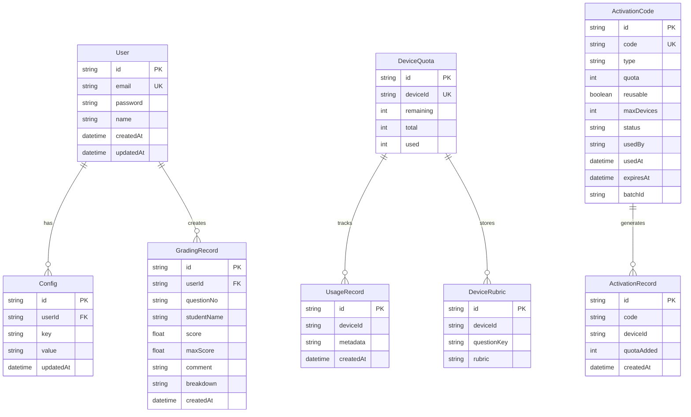
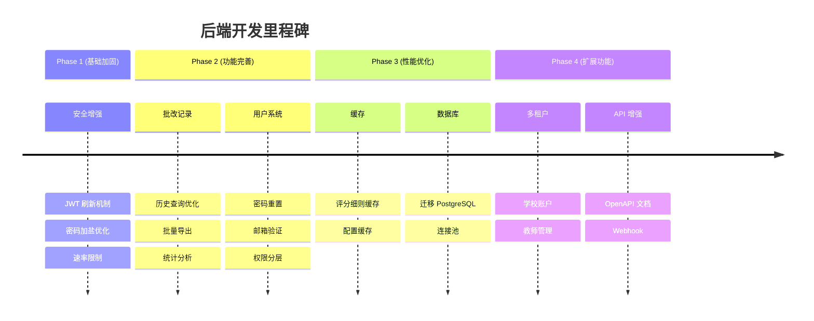

# 🏗️ 后端开发计划 - 初三历史智能阅卷系统

> **分析日期**: 2026-01-22  
> **当前版本**: 0.1.0  
> **技术栈**: Next.js 14 (App Router) + Prisma ORM + SQLite + JWT

---

## 📊 现有架构分析

### 技术栈概览

| 层级 | 技术选型 | 说明 |
|------|----------|------|
| **框架** | Next.js 14 (App Router) | 全栈框架，前后端一体 |
| **语言** | TypeScript | 类型安全 |
| **ORM** | Prisma 5.22 | 数据库操作抽象层 |
| **数据库** | SQLite (开发) | 轻量级，文件存储 |
| **认证** | JWT (jsonwebtoken) | 无状态认证 |
| **AI 服务** | GPTsAPI (Gemini-3/2.5) + 智谱 (GLM-4.6V) | 双引擎，自动降级 |

### AI 服务详细配置

| 服务商 | 角色 | 模型 | 用途 |
|--------|------|------|------|
| **GPTsAPI** | 主服务 | `gemini-3-pro-preview` | 深度推理 (Pro) |
|  |  | `gemini-3-flash-preview` | 快速评分 (Flash) |
|  |  | `gemini-2.5-flash` | 标准评分 |
|  |  | `gemini-2.5-flash-lite` | 轻量评分 |
| **智谱官方** | 备用服务 | `GLM-4.6V` | 故障降级，国内直连 |

> [!NOTE]
> **架构说明**：后端直连 GPTsAPI（第三方中转平台），无需自建代理层。GPTsAPI 提供 OpenAI 兼容格式接口，通过 `GPT_API_URL` 和 `GPT_API_KEY` 环境变量配置。智谱为国内直连备用方案，在 GPTsAPI 故障时自动降级。

---

### 现有数据模型 (8 个表)



---

### 现有 API 端点清单

#### ✅ 已完成

| 模块 | 端点 | 方法 | 功能 | 状态 |
|------|------|------|------|------|
| **健康检查** | `/api/health` | GET | 服务状态检查 | ✅ |
| **用户认证** | `/api/auth/login` | POST | 用户登录 | ✅ |
|  | `/api/auth/register` | POST | 用户注册 | ✅ |
| **用户信息** | `/api/user/profile` | GET | 获取用户资料 | ✅ |
| **AI 批改** | `/api/ai/grade` | POST | 批改学生答案 | ✅ |
|  | `/api/ai/grade` | GET | 获取剩余配额 | ✅ |
|  | `/api/ai/proxy` | POST | AI 代理转发 | ✅ |
|  | `/api/ai/rubric` | POST | 生成评分细则 | ✅ |
| **客户端** | `/api/client/activation` | POST | 激活设备 | ✅ |
|  | `/api/client/quota` | GET | 查询配额 | ✅ |
|  | `/api/client/quota/deduct` | POST | 扣减配额 | ✅ |
| **激活管理** | `/api/activation/generate` | POST | 生成激活码 | ✅ |
|  | `/api/activation/verify` | POST | 验证激活码 | ✅ |
| **管理后台** | `/api/admin/login` | POST | 管理员登录 | ✅ |
|  | `/api/admin/codes` | GET/POST | 激活码管理 | ✅ |
|  | `/api/admin/devices` | GET | 设备管理 | ✅ |
|  | `/api/admin/logs` | GET | 日志查看 | ✅ |
|  | `/api/admin/records` | GET | 批改记录 | ✅ |
|  | `/api/admin/stats` | GET | 统计数据 | ✅ |
|  | `/api/admin/usage` | GET | 使用分析 | ✅ |
| **数据同步** | `/api/sync/config` | GET/POST | 配置同步 | ✅ |
|  | `/api/sync/records` | GET/POST | 记录同步 | ✅ |
| **评分细则** | `/api/rubric` | GET/POST | 细则存储 | ✅ |

---

### 现有服务层

| 服务文件 | 功能 | 代码行数 |
|----------|------|----------|
| `lib/gpt.ts` | GPT-4o 批改服务（策略驱动） | 308 |
| `lib/zhipu.ts` | 智谱 GLM-4.6V 批改服务 | 261 |
| `lib/config-service.ts` | 配置和提示词管理 | 241 |
| `lib/rubric-types.ts` | 评分细则类型定义 | 约200 |
| `lib/api-response.ts` | 统一响应格式 | 约50 |
| `lib/auth.ts` | JWT 认证工具 | 约50 |
| `lib/prisma.ts` | Prisma 客户端 | 约20 |
| `lib/db.ts` | 数据库工具 | 约20 |

---

## 🎯 后端开发计划

### 里程碑概览



---

## 📋 Phase 1: 基础架构加固 (预计 3-5 天)

### 1.1 安全增强

> [!IMPORTANT]
> 安全是生产环境的首要考量，当前实现存在以下风险需要修复。

#### [MODIFY] [middleware.ts](file:///Users/hero/Desktop/ai-grading/aigradingbackend/src/middleware.ts)
- **问题**: 当前 CORS 仅在 `isDevelopment` 时放开，生产环境需要配置
- **改进**: 
  - 添加 `ALLOWED_ORIGINS` 环境变量支持
  - 生产环境白名单机制
  - 添加速率限制 (Rate Limiting)

#### [NEW] `lib/rate-limiter.ts`
- 实现基于 IP/设备ID 的请求频率限制
- 防止 API 滥用和 DDoS

#### [MODIFY] [auth.ts](file:///Users/hero/Desktop/ai-grading/aigradingbackend/src/lib/auth.ts)
- **添加功能**:
  - JWT 刷新令牌机制 (`refreshToken`)
  - Token 黑名单 (登出失效)
  - 更安全的密码哈希配置

#### [NEW] `/api/auth/refresh/route.ts`
- 刷新访问令牌端点

#### [NEW] `/api/auth/logout/route.ts`  
- 登出并使令牌失效

---

### 1.2 错误处理标准化

#### [MODIFY] [api-response.ts](file:///Users/hero/Desktop/ai-grading/aigradingbackend/src/lib/api-response.ts)
- 统一错误码体系
- 添加错误追踪 ID
- 结构化日志记录

```typescript
// 建议的错误码体系
enum ErrorCode {
  // 认证相关 1000-1999
  AUTH_TOKEN_EXPIRED = 1001,
  AUTH_TOKEN_INVALID = 1002,
  AUTH_INSUFFICIENT_PERMISSION = 1003,
  
  // 配额相关 2000-2999
  QUOTA_EXHAUSTED = 2001,
  QUOTA_DEVICE_NOT_FOUND = 2002,
  
  // AI 服务相关 3000-3999
  AI_SERVICE_UNAVAILABLE = 3001,
  AI_TIMEOUT = 3002,
  AI_PARSE_ERROR = 3003,
  
  // 业务逻辑 4000-4999
  RUBRIC_NOT_FOUND = 4001,
  RUBRIC_FORMAT_INVALID = 4002,
}
```

---

### 1.3 日志系统完善

#### [NEW] `lib/logger.ts`
- 结构化日志 (JSON 格式)
- 日志级别控制 (DEBUG/INFO/WARN/ERROR)
- 请求追踪 ID
- 敏感信息脱敏

```typescript
// 示例日志输出
{
  "timestamp": "2026-01-22T12:00:00Z",
  "level": "INFO",
  "traceId": "abc-123",
  "service": "ai-grade",
  "message": "Grading completed",
  "data": {
    "deviceId": "dev-***",
    "provider": "zhipu",
    "latency": 1234
  }
}
```

---

## 📋 Phase 2: 功能完善 (预计 5-7 天)

### 2.1 批改记录增强

#### [MODIFY] `/api/admin/records/route.ts`
- 添加分页支持 (`page`, `limit`)
- 添加筛选条件 (日期范围、得分区间、学生姓名)
- 添加排序支持

#### [NEW] `/api/admin/records/export/route.ts`
- 支持 CSV/Excel 导出
- 按条件批量导出

#### [NEW] `/api/admin/records/stats/route.ts`
- 题目难度分析
- 得分分布统计
- 时间趋势分析

---

### 2.2 用户系统完善

#### [NEW] `/api/auth/forgot-password/route.ts`
- 发送密码重置邮件
- 生成重置令牌

#### [NEW] `/api/auth/reset-password/route.ts`
- 验证令牌并重置密码

#### [NEW] `/api/user/settings/route.ts`
- 用户偏好设置
- 通知配置

#### [MODIFY] `prisma/schema.prisma`
- 添加 `Role` 枚举 (ADMIN, TEACHER, GUEST)
- 添加 `emailVerified` 字段

---

### 2.3 激活码系统优化

#### [MODIFY] `/api/admin/codes/route.ts`
- 批量生成激活码
- 激活码分组管理
- 导出激活码列表

#### [NEW] `/api/admin/codes/batch/route.ts`
- 批量操作 (禁用/启用/删除)

---

## 📋 Phase 3: 性能优化 (预计 3-5 天)

### 3.1 缓存层

#### [NEW] `lib/cache.ts`
- 内存缓存 (开发环境)
- Redis 适配器 (生产环境可选)

**缓存策略**:
| 数据类型 | TTL | 失效策略 |
|----------|-----|----------|
| 评分细则 | 1小时 | 更新时失效 |
| 设备配额 | 5分钟 | 扣减时失效 |
| 用户配置 | 15分钟 | 更新时失效 |

---

### 3.2 数据库优化

#### [MODIFY] `prisma/schema.prisma`
- 添加复合索引优化常用查询
- 考虑字段类型优化

```prisma
// 添加的索引
@@index([createdAt, deviceId]) // UsageRecord
@@index([userId, createdAt])   // GradingRecord
```

#### 生产环境迁移方案
- **短期**: 继续使用 SQLite (零运维)
- **中期**: 迁移到 Turso (SQLite 边缘托管，已有依赖)
- **长期**: PostgreSQL (如需要复杂查询)

---

### 3.3 AI 服务优化

#### [MODIFY] [gpt.ts](file:///Users/hero/Desktop/ai-grading/aigradingbackend/src/lib/gpt.ts)
- 添加请求重试机制
- 实现断路器模式
- 优化超时配置

#### [MODIFY] [zhipu.ts](file:///Users/hero/Desktop/ai-grading/aigradingbackend/src/lib/zhipu.ts)  
- Token 生成缓存（当前每次请求都重新生成）
- 连接池复用

---

## 📋 Phase 4: 扩展功能 (预计 7-10 天)

### 4.1 多租户支持

#### [NEW] `prisma/schema.prisma` 新模型

```prisma
model School {
  id        String   @id @default(cuid())
  name      String
  code      String   @unique // 学校代码
  quota     Int      @default(0)
  teachers  Teacher[]
  createdAt DateTime @default(now())
}

model Teacher {
  id        String   @id @default(cuid())
  userId    String   @unique
  schoolId  String
  role      String   @default("teacher") // teacher, admin
  user      User     @relation(fields: [userId], references: [id])
  school    School   @relation(fields: [schoolId], references: [id])
}
```

#### [NEW] `/api/school/*` 学校管理 API
- 学校注册/管理
- 教师分配
- 配额分配

---

### 4.2 API 文档化

#### [NEW] OpenAPI 规范
- 使用 `next-swagger-doc` 生成文档
- 添加 Swagger UI 访问入口 (`/api/docs`)

---

### 4.3 Webhook 支持

#### [NEW] `/api/webhooks/register/route.ts`
- 注册回调地址
- 事件订阅配置

**支持的事件**:
- `grading.completed` - 批改完成
- `quota.low` - 配额即将用尽
- `activation.used` - 激活码被使用

---

## 🧪 验证计划

### 自动化测试

> [!NOTE]
> 当前项目尚未发现现有测试文件。建议新增以下测试。

#### [NEW] `__tests__/api/` 目录结构
```
__tests__/
├── api/
│   ├── auth.test.ts      # 认证相关测试
│   ├── grade.test.ts     # AI 批改测试
│   └── quota.test.ts     # 配额系统测试
├── lib/
│   ├── gpt.test.ts       # GPT 服务测试
│   └── zhipu.test.ts     # 智谱服务测试
└── setup.ts              # 测试配置
```

#### 测试命令
```bash
# 添加到 package.json
"scripts": {
  "test": "jest",
  "test:watch": "jest --watch",
  "test:coverage": "jest --coverage"
}
```

### 手动测试检查清单

| 功能点 | 测试步骤 | 预期结果 |
|--------|----------|----------|
| 健康检查 | `curl http://localhost:3000/api/health` | 返回 `{"success": true}` |
| 管理员登录 | POST `/api/admin/login` with password | 返回 JWT token |
| AI 批改 | POST `/api/ai/grade` with image + rubric | 返回评分结果 |
| 配额扣减 | 多次调用批改 API | 配额逐次减少 |

---

## 📁 目录结构建议

```
aigradingbackend/
├── src/
│   ├── app/
│   │   ├── api/
│   │   │   ├── ai/           # AI 相关
│   │   │   ├── admin/        # 管理后台
│   │   │   ├── auth/         # 认证
│   │   │   ├── client/       # 客户端专用
│   │   │   ├── school/       # 学校管理 (新增)
│   │   │   ├── sync/         # 数据同步
│   │   │   └── webhooks/     # Webhook (新增)
│   │   └── admin/            # 管理后台页面
│   ├── lib/
│   │   ├── ai/               # AI 服务 (重构)
│   │   │   ├── gpt.ts
│   │   │   ├── zhipu.ts
│   │   │   └── router.ts
│   │   ├── cache.ts          # 缓存 (新增)
│   │   ├── logger.ts         # 日志 (新增)
│   │   ├── rate-limiter.ts   # 限流 (新增)
│   │   └── ...
│   ├── middleware.ts
│   └── types/
├── prisma/
│   ├── schema.prisma
│   └── migrations/
├── __tests__/                # 测试 (新增)
└── docs/                     # API 文档 (新增)
```

---

## 🔑 核心架构决策：激活码作为轻量账号

> [!IMPORTANT]
> **已确认方案**：使用激活码（而非用户注册）关联批改记录，实现跨设备数据同步

### 架构设计

```
┌─────────────────────────────────────────────────┐
│              教师使用流程                        │
├─────────────────────────────────────────────────┤
│  1. 输入激活码 → 验证 + 获取配额                 │
│  2. 批改答卷 → 记录关联到激活码                  │
│  3. 换设备 → 输入同一激活码 → 恢复历史           │
└─────────────────────────────────────────────────┘
```

### 数据模型改动

#### [MODIFY] `prisma/schema.prisma`

```prisma
model GradingRecord {
  id             String   @id @default(cuid())
  // userId      String   // 移除或保留为可选
  deviceId       String   // 保留，用于追踪来源设备
  activationCode String   // 新增：关联激活码
  questionNo     String?
  studentName    String
  score          Float
  maxScore       Float
  comment        String?
  breakdown      String?
  createdAt      DateTime @default(now())

  @@index([activationCode])  // 新增索引
  @@index([deviceId])
}
```

### API 改动

| 端点 | 改动 |
|------|------|
| `POST /api/ai/grade` | 接收 `activationCode`，记录关联激活码 |
| `GET /api/sync/records` | 按 `activationCode` 查询历史记录 |
| `GET /api/admin/stats` | 支持按激活码聚合统计 |

### 前端改动

| 文件 | 改动 |
|------|------|
| 批改请求 | 带上当前激活码 |
| 历史记录页 | 调用同步API获取历史 |
| 本地缓存 | 作为离线备份 |

---

## 📝 批改记录模块完善清单

> [!NOTE]
> 基于代码分析，当前批改记录模块存在以下问题需要修复

### 现状分析

| 组件 | 当前状态 | 问题 |
|------|----------|------|
| **前端 HistoryView** | ✅ 本地存储完善 | ❌ 未调用后端同步 API |
| **后端 /api/sync/records** | ✅ API 已实现 | ❌ 按 userId 关联，需改 activationCode |
| **数据同步** | ❌ 无 | 换设备丢失历史 |

### 修复任务

#### [MODIFY] `prisma/schema.prisma`
- 移除 `userId` 必填约束
- 添加 `activationCode` 字段
- 添加 `deviceId` 字段（追踪来源）

#### [MODIFY] `/api/sync/records/route.ts`
```typescript
// 改为按 activationCode 查询
const activationCode = request.headers.get('x-activation-code');
const where = { activationCode };
```

#### [MODIFY] `/api/ai/grade/route.ts`
- 批改成功后自动保存到 GradingRecord

#### [NEW] 前端同步服务
```typescript
// services/record-sync.ts
export async function syncRecordsToServer(activationCode: string, records: HistoryRecord[]) {
  // 上传本地记录到服务器
}

export async function fetchRecordsFromServer(activationCode: string) {
  // 从服务器拉取历史记录
}
```

#### [MODIFY] `HistoryView.tsx`
- 启动时从服务器拉取历史
- 本地记录作为离线缓存
- 新记录实时同步

---

## 📋 评分细则持久化问题

> [!NOTE]
> 用户反馈：刷新页面后评分细则需要重新导入

### 现状分析

| 组件 | 当前状态 | 说明 |
|------|----------|------|
| **前端 rubric-storage.ts** | ✅ Local-First 策略 | 本地优先 + 后端异步同步 |
| **后端 DeviceRubric 表** | ✅ 已存在 | 按 deviceId + questionKey 唯一 |
| **后端 API /api/rubric** | ✅ 已实现 | 支持 GET/POST |

### 问题定位

1. **按 deviceId 关联** - 换设备丢失评分细则
2. **前端同步可能未触发** - 需要验证同步流程是否正常工作

### 修复任务

#### [MODIFY] `prisma/schema.prisma`
```prisma
model DeviceRubric {
  id             String   @id @default(cuid())
  deviceId       String   // 保留，追踪来源
  activationCode String   // 新增：关联激活码
  questionKey    String
  rubric         String
  createdAt      DateTime @default(now())
  updatedAt      DateTime @updatedAt

  @@unique([activationCode, questionKey])  // 改为按激活码唯一
  @@index([activationCode])
}
```

#### [MODIFY] 后端 `/api/rubric/route.ts`
- 接收 `x-activation-code` header
- 按 activationCode 存取评分细则

#### [MODIFY] 前端 `rubric-storage.ts`
- 请求时带上 activationCode header
- 验证同步流程正常触发

---

## 🚦 优先级排序（最终版）

> [!IMPORTANT]
> **核心目标**：直接面向用户，聚焦 **智能批改 + 批改记录 + 数据分析** 三大功能

### P0 - 立即执行 (上线必需)
| 任务 | 说明 | 涉及文件 |
|------|------|----------|
| 数据模型改造 | GradingRecord 添加 activationCode、deviceId | `schema.prisma` |
| 后端 API 改造 | 同步 API 改为按 activationCode 查询 | `sync/records/route.ts` |
| 批改时自动存储 | 批改成功后保存记录到数据库 | `ai/grade/route.ts` |
| 前端同步服务 | 新增 record-sync.ts 服务 | `services/record-sync.ts` |
| CORS 生产配置 | 允许前端域名访问 | `middleware.ts` |

### P1 - 上线后 (1-2 周)
| 任务 | 说明 |
|------|------|
| **批改记录增强** | 分页查询、筛选、导出 CSV |
| **数据分析 API** | 题目难度、得分点分析、教学建议 |
| AI 稳定性 | 重试机制、超时优化 |

### P2 - 中期 (2-4 周)
| 任务 | 说明 |
|------|------|
| 用户账号配额 | 从设备 ID 迁移到用户账号 |
| 统计报表完善 | 班级对比、学生追踪 |
| **阅卷策略偏好持久化** | 换设备保留策略选择（flash/pro/reasoning） |
| 智谱策略支持 | 备用 AI 也支持策略切换 |
| 安全增强 | JWT 刷新、速率限制 |

### P3 - 长期规划
| 任务 | 说明 |
|------|------|
| 多用户支持 | 简单的用户隔离（非复杂多租户） |
| 数据库迁移 | 用户量增长后考虑 |
| 报表导出 | PDF 成绩单、Excel 汇总 |

---

## 💡 探究问题（下一步讨论）

基于 **智能批改 + 批改记录 + 数据分析（题目维度 + 教学建议）** 三大核心功能：

### 数据分析设计（基于题目，无学生信息）

```
┌─────────────────────────────────────────────────┐
│            数据分析模块架构                      │
├─────────────────────────────────────────────────┤
│  输入：批改记录（题号、得分、评语、得分点明细）   │
├─────────────────────────────────────────────────┤
│                    分析维度                      │
├───────────────┬───────────────┬─────────────────┤
│   题目难度    │   得分点分析   │   错误模式      │
│ • 平均分      │ • 各点得分率   │ • 常见错误类型  │
│ • 满分率      │ • 薄弱得分点   │ • 错误原因归类  │
│ • 零分率      │ • 关联性分析   │                 │
├───────────────┴───────────────┴─────────────────┤
│                  输出：教学建议                   │
│ • 哪些知识点需要重点讲解                         │
│ • 常见误区提醒                                   │
│ • 建议的教学策略调整                             │
└─────────────────────────────────────────────────┘
```

### 待确认问题

1. **分析粒度**: 是按单个题目分析，还是支持按题型/知识点聚合？

2. **教学建议生成**: 
   - 基于规则的建议（如：得分率<60% → 建议重点讲解）？
   - 还是调用 AI 生成个性化教学建议？

3. **分析时机**: 
   - 实时分析（批改时即计算）？
   - 还是定时汇总（每日/每周报告）？

---

## 🧪 验证计划

### 自动化测试

当前项目缺少测试覆盖，建议新增：

```bash
# 安装测试依赖
npm install -D jest @types/jest ts-jest

# 运行测试
npm test
```

| 测试文件 | 覆盖范围 |
|----------|----------|
| `__tests__/api/sync-records.test.ts` | 记录同步 API |
| `__tests__/api/rubric.test.ts` | 评分细则 API |
| `__tests__/api/grade.test.ts` | 批改 API |

### 手动验证清单

#### P0 验证：激活码存储改造

| # | 步骤 | 预期结果 |
|---|------|----------|
| 1 | 设备A 输入激活码并批改 | 记录保存成功 |
| 2 | 设备B 输入同一激活码 | 能看到设备A的批改历史 |
| 3 | 设备A 创建评分细则 | 细则保存成功 |
| 4 | 设备B 查看评分细则 | 能看到设备A创建的细则 |

#### API 测试命令

```bash
# 健康检查
curl http://localhost:3000/api/health

# 查询批改记录（带激活码）
curl -H "x-activation-code: ZY-TEST-1234" \
     http://localhost:3000/api/sync/records

# 查询评分细则
curl -H "x-activation-code: ZY-TEST-1234" \
     http://localhost:3000/api/rubric?questionKey=test-q1
```

---

*此文档由 AI 助手基于代码分析自动生成，建议与开发团队讨论后确定最终方案。*
